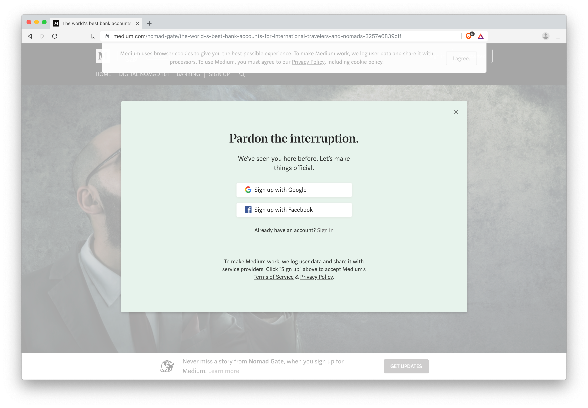

Over the last few years, I've seen more and more blogs move over completely or partially to Medium. And while a few years ago that might have seemed like a good idea, that's definitely not the case anymore.

Particularly for *evergreen* content.

Here's why.

## My history with Medium
In 2015, [Nomad Gate](https://nomadgate.com) was born as a side project—on Medium. To benefit from Medium's strong domain authority, I decided to not use a custom domain on Medium but rather hosted the site on *medium.com/nomad-gate*.

I wrote three long-form, in-depth articles that summer, and before long, two of them started to see a good amount of traffic every month. One was about the Estonian e-Residency program and the other about the world's best banks for nomads and frequent international travelers.

While I stopped writing new articles for nearly two years after joining [Teleport](https://teleport.org), I did continue to update those articles based on reader feedback and tips. I would also update them whenever banks changed their offerings and as the e-Residency program evolved.

When I picked up the Nomad Gate project again in the spring of 2017, I decided to host the site myself on *nomadgate.com*, using the static site generator *Jekyll* to build the site.

All articles that I wrote from this point onwards were posted on my own site, but I left the old articles on Medium for the time being.

Although I believed this would give me more flexibility to grow Nomad Gate, I was far from certain I was making the right decision. After all, how would articles I posted on a new domain with no domain authority be able to rank well on Google?

Luckily, it was the best decision I could have made.

## Why Nomad Gate left Medium
Most of the articles on Nomad Gate are potentially *evergreen*, at least as long as I regularly keep them up to date. The main issue evergreen content is facing on Medium is that you can't update the date of an article.

Why is this important?

SEO, of course.

Not only does Google prefer to feature more recent content in its search results, but users are also more likely to click an article with a recent date listed next to it.

The articles I had published on Medium had been updated continuously and were as fresh and relevant then as they were in 2015. However, I could see them starting to slip in the Google results.

Self-hosting, this wouldn't be an issue. Hence I made the move to *nomadgate.com*.

## Migrating my old articles off Medium
After re-launching Nomad Gate on my own domain, I noticed that the new articles I posted there also ranked well in Google. And not only that, but I also saw first hand how much it helped to update the *published date* whenever I updated an article.

Yet, I still wasn't sure what the impact would be on my old Medium articles if I moved them over as well. But in July 2018 I decided to find out.

I did a proper rewrite of the banking article I originally wrote back in 2015, making sure it was completely up to date and relevant. And instead of updating the version of the article that lived on Medium, I posted it on nomadgate.com.

In order to benefit from the existing SEO juice of the version on Medium and avoid Google marking the new article as a duplicate, I reached out to the Medium team (yourfriends@medium.com) and asked if they could update the *canonical URL* of the article so that it pointed to the new version on nomadgate.com.

It worked out really well. After a few days Google had discovered the new canonical link, and the nomadgate.com version basically took over the medium.com version's spot in the search results within a week. About ten days later the new article had as much traffic per day as the old Medium article had before the switch, and another week later it had about 40% more.

And if that wasn't good enough, moving the article to nomadgate.com seemed to improve the rankings of all the other articles on the same domain. Overall, the visits to nomadgate.com more than doubled in less than a month, and the direct traffic to the banking article was only responsible for about half of the increase.

So when I decided to do a major update of the Estonian e-Residency article in December 2018, I obviously decided to follow the same procedure...only to discover that it was *no longer possible*.

Luckily, I've figured out a workaround.

## Why Medium is now a worse choice than ever before

Over the past year, Medium has quietly been making a series of changes that are all bad news for writers who still publish articles on their platform.

I discovered the most recent—and most significant—change when I emailed the Medium support a few days ago asking to update the canonical links of the e-Residency article that I had just re-written and updated on nomadgate.com.

### It's no longer possible to change canonical links of articles

After emailing yourfriends@medium.com with the new canonical link that I wanted for the article (like I had done a few months earlier), I quickly got a reply from the same person that had helped me the last time. His email read:

> If you simply copy/paste posts from your site to Medium, we set the canonical tag to point to the new Medium post and there is no way for you (or us) to set it to something else.

> To make sure that your Medium posts have a canonical tag that points to the original URL, use our import tool (https://medium.com/p/import).

Oh, shit.

Of course I knew that the only way to set the canonical URL correctly from the beginning is to use the import tool.

But this was the bit that surprised me: "there is no way for you **(or us)** to set it to something else."

Here's the same guy who made the same exact change for me a few months earlier saying that it's not *possible* for them to make the change.

If he had said that they no longer *want* to do it, that would have been one thing. A heads-up would have been nice, but still, that's their prerogative.

But to say that it's not *possible* for them is clearly a lie.

Medium, if you ever read this: I don't appreciate being lied to.

To top it off, they simply ignored [the two (polite) follow-up emails](https://cl.ly/93ce51946717) I sent them.

Not so friendly anymore, or what, Medium? Maybe consider changing your *YourFriends*@medium.com address?

### It's no longer possible to add custom domains

If I had used a custom domain for my Medium publication, it wouldn't have been much of an issue. In that case, I could have just set up *301 redirects* to the new articles and deleted the old ones from Medium. All the SEO juice would have been preserved, and Google would have shown the updated article in the search results.

Unfortunately, after a bit of Googling I found out that Medium removed the possibility to add your own custom domains, so it was too late for my Nomad Gate publication to get on that gravy train.

But thanks to a great deal of luck and good fortune, **I eventually discovered a workaround**.

While I can't change the canonical links of my remaining Medium posts, I found a way to add 301 redirects to them instead—which in many ways is even better!

Try going to [https://medium.com/nomad-gate/estonian-e-residency-ultimate-guide-banking-taxes-cc27fe39c368](https://medium.com/nomad-gate/estonian-e-residency-ultimate-guide-banking-taxes-cc27fe39c368) and see where you end up.

Yup, that's right!

You won't even land on medium.com, but rather be redirected instantly to the [new version of the article on nomadgate.com](https://nomadgate.com/estonian-e-residency-guide/).

I'm not sure if I should share the workaround publicly (in case it will trigger Medium to block it), so let me just say that it's pretty easy to spot what I did if you're a bit tech-savvy.

If you want to know, you can always [contact me](https://nomadgate.com/contact/).

### Limitations on embeds making list building harder

Not only has Medium made it more difficult to leave their platform, but it's also harder than ever to grow your audience on Medium.

Anyone who's been publishing on Medium for a while knows that a follower on Medium is only worth a tiny fraction of a newsletter subscriber on your own blog. For a while, you were allowed to use services like [Upscribe](https://upscri.be/) to embed a signup form in your Medium articles.

However, early in 2018, those embeds were all but made useless. Now you'll have to send readers over to an external website before asking them to sign up.

### New restrictions on business models

I recently discovered that HackerNoon, one of the most read publications on Medium is [raising funds to leave the platform](https://www.startengine.com/hackernoon). Their reasons include a new ban on all types of third-party ads on Medium, including sponsorships—which is how HackerNoon had been monetizing.

Having your own website as a hub for all your content means that no one else can restrict your choice of business model.

And honestly, hosting all your content with a tech company with its own set of incentives is a terrible idea. And their current incentives are mainly to redirect your readers to other (mostly premium) stories on Medium so that they will start paying them $5 per month.

Does that sound like a good idea to you?

### You can build a much more user-friendly experience

While Medium initially provided a great reading experience, that's no longer the case.

This is what your readers who are not logged in to a Medium account encounter when they visit your articles:

Here's how readers on Nomad Gate see the same article:

No annoying popups, no cookie notices, no ad tracking (only anonymized Google Analytics), no bullshit. Just the article you came to read, and nothing more.

The above is just one example of how Medium will annoy your readers. Check out [this article](https://medium.com/@nikitonsky/medium-is-a-poor-choice-for-blogging-bb0048d19133) (ironically posted on Medium) for a lot more examples.

Your readers deserve better than Medium.

## How to use Medium in 2019

Is it still OK to post on Medium?

Sure, with some caveats:

- Always publish to your own domain first.
- When cross-posting to Medium, always, always use their somewhat hidden [Import Story feature](https://medium.com/p/import). That will set the canonical link for the story to your domain.
- Always promote your own version of the article. Don't send traffic to someone else's domain.
- Provide plenty of links back to your own website within the stories you post on Medium.

Is it worth it?

Honestly, I'm not sure. With a few thousand followers on Medium, an article I cross-posted there in July had only seen a bit more than 100 views generated by Medium by December. The version of that article on Nomad Gate has continued to gain traffic since then.

I'm not sure if posting on Medium had anything to do with it, but at least it seems safe to continue syndicating articles there—as long as you follow the steps above.