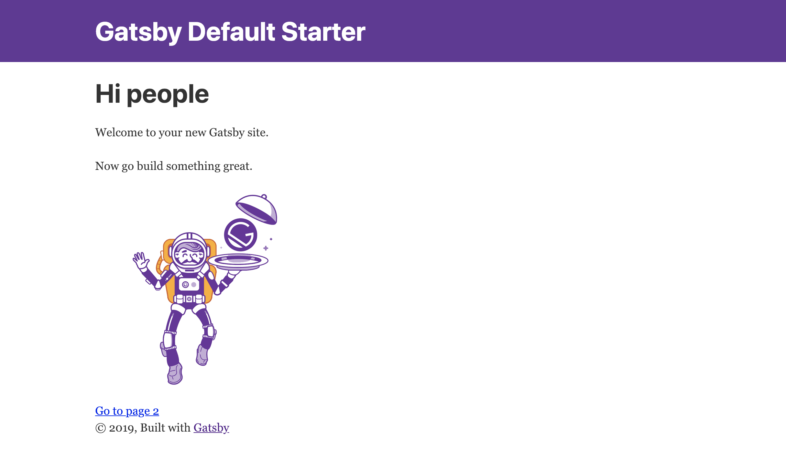
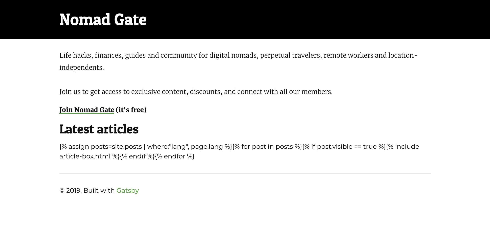

I was first introduced to the fantastic world of static site generators in 2015 while working for Teleport. 

When I in late 2016 started building out the first proper version of Nomad Gate, I decided to build it with Jekyll, the static site generator created by GitHub founder `TKTKTK`.

While Jekyll has served me really well over the years, I've started to notice some of its limitations.

- While great for pure content sites/blogs, it's not great for directories pulling data from a range of sources
- It's not great for working with and generating pages based on structured data
- It doesn't work well with modern technologies such as React

Up until now, none of these really mattered that much. The Nomad Gate website isn't particularly interactive. The most "fancy" I ever got was to add some vanilla JavaScript to get the logged in status of a user from Discourse (which I use for the [community forums](https://community.nomadgate.com)) and change the content on the content site based on that.

`TKTKTK add the JS code to GitHub and separate post, and link to it from here.`

But going forward I'd like to build some more advanced tools that I believe my readers will find useful. Perhaps a tool to compare bank accounts around the world. Perhaps a some more interactive guides. Or perhaps automating some of the work it takes to keep certain articles up to date.

I have several ideas that would be much easier to implement if I could pull in data from a lot of sources at *build time*, as well as at *run time*.

Luckily for me, there's a new kid on the block in the SSG landscape: GatsbyJS. Or just Gatsby, as it's often called.

While I don't have *a lot* of experience with JS, and pretty much zero experience with React (which Gatsby is built on), but I (perhaps somewhat naively?) saw it as a great learning opportunity.

---

## Migrating from Jekyll to GatsbyJS

The rest of the article will be a strange mix of a *case study* where I go into detail of what I personally did to migrate Nomad Gate, and trying generalize as much as possible of that into instructions that are relevant for your own migration.

Here goes.

### Setting up Gatsby

After [installing Gatsby](https://www.gatsbyjs.org/tutorial/part-zero/#install-gatsby-cli) on my system I just ran `gatsby new nomadgate-v2` to set up my new Gatsby instance with the default starter.

If you'd like to use one of [the other starters available](https://www.gatsbyjs.org/starters/?v=2) you just add the Github URL of the starter to end of that command.

```bash
gatsby new [your_directory] [url_of_starter]
```

E.g. `gatsby new my_site https://github.com/gatsbyjs/gatsby-starter-hello-world` to use the Hello World starter.

Inside my Gatsby directory (`cd nomadgate-v2`) I also ran `npm install gatsby-cli --save` to add Gatsby to the list of dependencies for the project. This is required for my host (Netlify) to build the site when pushed to production.

### Hosting
Speaking of hosting, I'd definitely recommend using [Netlify](https://www.netlify.com/) for all your static sites. They are *fucking amazing*.

You still just push your code to your GitHub/GitLab/Bitbucket repo and your site will build automatically—just like you were using GitHub Pages.

Except you can use any static site generator you want, not just Jekyll.

And you have no limitations in terms of plugins.

And you get automatically provisioned HTTPS certificates for your custom domains.

And you can add unlimited amounts of [rewrite and redirect rules](https://www.netlify.com/docs/redirects/) (it's a bit like CloudFlare's Page Rules, but unlimited, free, and much more awesome). *You can even use it for reverse proxying*.

I mean, you could set up and run your own web server on a Linux machine, add NGINX, and try to [get their reverse proxying to work](https://docs.nginx.com/nginx/admin-guide/web-server/reverse-proxy/).

But why would you, when you can just add something like `/docs/*  https://docs.example.com/:splat  200` to your `_redirects` file and be done?

Did I mention *how much I love Netlify*?

Anyway, I digress.

Just initialize a local git repository in your Gatsby site directory, push to GitHub, connect your repo to Netlify, and your site is live on the web.

### A Sassy CSS migration

Back to the actual migration.

In Jekyll I had been using SCSS (Sassy CSS) to generate the stylesheets. My hope was that I could just move those files over to Gatsby without much adaption.

And sure enough, it was a completely painless process.

In Jekyll I had a file called `main.scss` which in turn imported three more SCSS files located in my `_sass` directory. The `main.scss` file also contained a bit of front matter, as required by Jekyll.

To migrate my styles to Gatsby, I:

- Created the directory `/src/styles` and placed all four SCSS files there.
- Removed the *front matter* from `main.scss`.
- Installed the [Gatsby Sass Plugin](https://www.gatsbyjs.org/packages/gatsby-plugin-sass/) by adding ``gatsby-plugin-sass`` to the plugin section of `gatsby-config.js`.

My plugin section now looked like this:

```javascript
plugins: [
    `gatsby-plugin-react-helmet`,
    {
      resolve: `gatsby-source-filesystem`,
      options: {
        name: `images`,
        path: `${__dirname}/src/images`,
      },
    },
    `gatsby-plugin-sass`,
    `gatsby-transformer-sharp`,
    `gatsby-plugin-sharp`,
    {
      resolve: `gatsby-plugin-manifest`,
      options: {
        name: `gatsby-starter-default`,
        short_name: `starter`,
        start_url: `/`,
        background_color: `#663399`,
        theme_color: `#663399`,
        display: `minimal-ui`,
        icon: `src/images/gatsby-icon.png`, // This path is relative to the root of the site.
      },
    },
  ],
```

Finally I just imported the `main.scss` file into the default template located in `layout.js` by adding `import '../styles/main.scss'`.

If you use a different starter than the default one I used, your default template might be located elsewhere, or there might exist one yet. The principle is the same, just import the `main.scss` file where the CSS is needed.

### Baby steps

While Jekyll doesn't rely on components in the exact same way as Gatsby, I had still structured most of my code in a similar way.

My `_includes` folder in Jekyll contained 40 files at the time of my migration, each of which roughly corresponds to a *component* in Gatsby.

You may or may not have structured your Jekyll code in the same way.

At this point I decided to try to recreate the homepage of Nomad Gate as the first step.

This is how it looked like in its logged out state:


It primarily consisted of these components main components:

- The large header area with the hero image, logo, navigation bar, etc.
- An introduction text that was generated on the fly based on the logged in/out state of the user.
- The list of articles (including background images) that was generated *on build* by looping through all the files in Jekyll's `_posts` folder.
- A footer section with a bunch of internal links.

My `index.html` in Jekyll looked like this:

```html
---
layout: default
cover_image: /uploads/covers/loner.jpg
headline: "Your guide to a location-independent life"
image: /uploads/nomad-gate-share.jpg
title: "Nomad Gate – Your Guide to a Location-Independent Life"
description: "Nomad Gate – Life hacks, finances, guides and community for digital nomads, perpetual travelers, remote workers and location independents."
lang: en
ref: index
---

<div class="home">
  <div class="post-content"><p>Life hacks, finances, guides and community for digital nomads, perpetual travelers, remote workers and location-independents.</p></div>
  <h1 class="page-heading loggedOut" style="display: none;">We are a <a href="https://community.nomadgate.com">community</a> of <span id="number">thousands of</span> digital nomads ✈️, remote workers 👩‍💻, and world citizens 🌏</h1>
  <h1 class="loggedIn hasFname" id="greeting" style="display: none;">Welcome back you!</h1>
  <h1 class="loggedIn lacksFname" style="display: none;">Welcome back!</h1>
  <div class="post-content">
    <div class="loggedOut">
      <p>Join us to get access to exclusive content, discounts, and connect with all our members.</p>
      <p><strong> (it's free)</strong></p>
    </div>
    <div class="loggedIn" style="display: none;">
      <p>Sweet, you are now logged into your account!</p>
      <p>You can <a href="/contact/">chat with me</a>, access member-only information on various pages, and join the discussion in our <a href="https://community.nomadgate.com">community forums</a>! 🎉</p>
      <p></p>
      <p>I'm looking forward to seeing you inside!</p>
      <p>-Thomas</p>
    </div>
    <h2 class="page-heading">Latest articles</h2>

    <section class="latest-articles">
      
      
      <!-- article -->
      
      
    </section>
  </div>
</div>
<script>
if (discourse_name) {
  var paragraph = document.getElementById("greeting");
  paragraph.textContent = "Welcome back, " + first_name + "! 👋";
}
if (totalUsers) {
  var totalusers_paragraph = document.getElementById("number");
  totalusers_paragraph.textContent = totalUsers;
}
</script>
```



Next, I copied all the HTML contained in `<div class="home">` and ran it through [this HTML to JSX compiler](https://magic.reactjs.net/htmltojsx.htm).

Then I replaced the bulk of the JSX in the IndexPage constant found in `/src/pages/index.js` of my Gatsby site with the resulting output.

I also removed the lines importing the Image and Link components since those were no longer in use, and changed the info contained in the SEO tag.

My `index.js` file then looked like this:

```javascript
import React from 'react'
import Layout from '../components/layout'
import SEO from '../components/seo'

const IndexPage = () => (
  <Layout>
    <SEO title="Nomad Gate" keywords={[`digital nomad`, `location-independent`, `expat`]} />
    <div className="home">
        <div className="post-content"><p>Life hacks, finances, guides and community for digital nomads, perpetual travelers, remote workers and location-independents.</p></div>
        <h1 className="page-heading loggedOut" style={{display: 'none'}}>We are a <a href="https://community.nomadgate.com">community</a> of <span id="number">thousands of</span> digital nomads ✈️, remote workers 👩‍💻, and world citizens 🌏</h1>
        <h1 className="loggedIn hasFname" id="greeting" style={{display: 'none'}}>Welcome back you!</h1>
        <h1 className="loggedIn lacksFname" style={{display: 'none'}}>Welcome back!</h1>
        <div className="post-content">
          <div className="loggedOut">
            <p>Join us to get access to exclusive content, discounts, and connect with all our members.</p>
            <p><strong><a href="https://community.nomadgate.com/signup">Join Nomad Gate</a> (it's free)</strong></p>
          </div>
          <div className="loggedIn" style={{display: 'none'}}>
            <p>Sweet, you are now logged into your account!</p>
            <p>You can <a href="/contact/">chat with me</a>, access member-only information on various pages, and join the discussion in our <a href="https://community.nomadgate.com">community forums</a>! 🎉</p>
            <p />
            <p>I'm looking forward to seeing you inside!</p>
            <p>-Thomas</p>
          </div>
          <h2 className="page-heading">Latest articles</h2>
          <section className="latest-articles">
            {'{'}% assign posts=site.posts | where:"lang", page.lang %{'}'}
            {'{'}% for post in posts %{'}'}{'{'}% if post.visible == true %{'}'}
            {/* article */}
            {'{'}% include article-box.html %{'}'}
            {'{'}% endif %{'}'}{'{'}% endfor %{'}'}
          </section>
        </div>
      </div>
  </Layout>
)

export default IndexPage
```

…

At this point the homepage of my new Gatsby site had morphed into this:



Still a far cry from the original homepage of Nomad Gate v1, but at least I could see that the CSS was working properly.